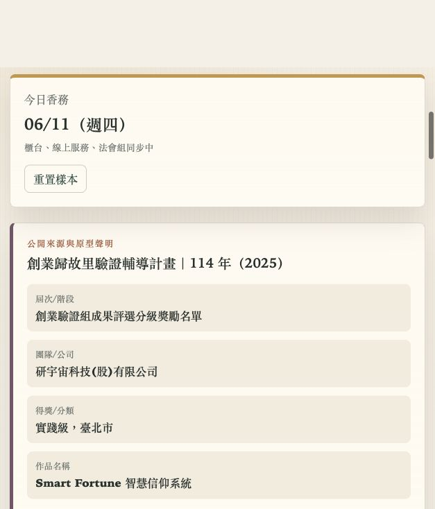

# Smart Fortune 智慧信仰系統

## 快速看懂

- 線上 Demo：https://atlasforcn.github.io/startup-smart-fortune-faith/
- 這個原型在做什麼：把 Smart Fortune 做成廟務與信仰服務數位工作台。
- 特色定位：特色是把祈福預約、點燈法會、功德金與信眾會員整合成廟方可營運的系統。
- 操作流程：建立祈福、點燈或法會訂單 → 查看信眾會員、功德金與待辦通知 → 用流程引導完成籤詩/祭祀服務追蹤

展開完整功能流程截圖

這是一個可直接用瀏覽器開啟的靜態 demo repo，將「Smart Fortune 智慧信仰系統」概念做成廟務與信仰服務數位平台工作台。介面不是單純介紹頁，而是提供可操作的祈福預約、線上點燈與法會訂單、信眾會員卡、功德金收支看板、籤詩與祭祀流程引導、廟方待辦與通知。

## 使用方式

直接在瀏覽器開啟 `index.html` 即可使用。不需要安裝套件、不需要建置流程，可放在 GitHub Pages。

## 比賽與來源資訊

- 比賽來源：創業歸故里驗證輔導計畫
- 年度：114 年（2025）
- 屆次/階段：創業驗證組成果評選分級獎勵名單
- 團隊/公司：研宇宙科技(股)有限公司
- 得獎/分類：實踐級，臺北市
- 作品名稱：Smart Fortune 智慧信仰系統
- 官方來源：https://sccontest.tca.org.tw/content/display#sectionA

## 免責聲明

這是依公開得獎資訊與概念自行製作的興趣原型，不是原團隊官方 demo 或產品。頁面中的廟務流程、金額、會員資料、通知與營運數據皆為示範資料，用於呈現可能的數位平台操作方式。

## Demo 功能

- 祈福服務預約：建立預約單、查看今日與近期服務。
- 線上點燈/法會訂單：選擇燈種與法會，估算功德金並加入待處理訂單。
- 信眾會員卡：查看會員等級、累積功德點、近期服務，並可新增示範會員。
- 功德金收支看板：新增收入或支出，查看淨額、分類與收支紀錄。
- 籤詩/祭祀流程引導：抽取示範籤詩，依序勾選參拜流程。
- 廟方待辦與通知：新增待辦、完成待辦，查看即時通知。

## 技術說明

- 純 HTML/CSS/JavaScript，無外部依賴。
- 使用 `localStorage` 保存示範操作資料。
- 響應式排版，支援桌機、平板與手機瀏覽。

## 8 位專家補強

- 使用者與痛點：宮廟需要管理活動、服務與信眾通知，使用者需要清楚流程與費用而非神秘結果。
- 市場與差異：替代方案是紙本、電話與通訊群組；差異在廟務紀錄、預約和透明服務。早期客群從單一宮廟場域試辦，導入需尊重宗教治理。
- 驗證：記錄預約轉換、報到、取消、工作人員工時、信眾回饋與活動成效指標。
- 商業模式：宮廟依模組付費訂閱，另有導入與設備報價；收入、客服、簡訊與現場維運成本決定毛利。
